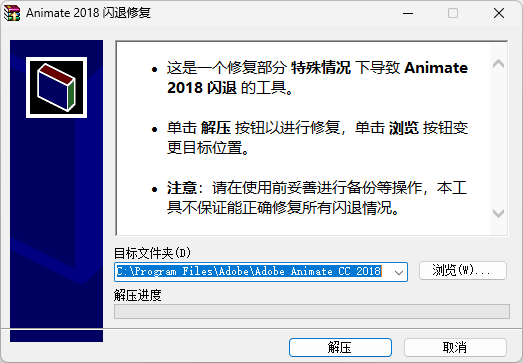

# Animate 2018 闪退修复

## 概述

- 这是一个修复部分 **特殊情况** 下导致 **Animate 2018** 闪退的工具。
- **注意**：请在使用前妥善进行备份等操作，本工具不保证能正确修复所有闪退情况。

制作缘由是在我的公司电脑中，不知何种原因（即使是全新安装的系统，Win10/11），导致运行 Animate 部分版本出现闪退。

经过查看 **事件查看器** 的崩溃日志，得知问题出现在 **ZXPSignLib-minimal.dll** 和 **PlugPlugOwl.dll** 文件上，通过提取其他未受崩溃影响的 Animate 版本文件，制作了该补丁，默认修复 Animate 2018 版本。

默认修复路径为 **%PROGRAMFILES%\Adobe\Adobe Animate CC 2018**，如果您的默认安装目录不是此目录，您需要手动点击 **浏览** 按钮重定向到您的安装目录。

## 下载

- 点击 [此处下载](https://github.com/Liushui-Miaomiao/UtilityGadgets/raw/refs/heads/master/%E4%BF%AE%E5%A4%8D%E5%B7%A5%E5%85%B7/Animate%202018%20%E9%97%AA%E9%80%80%E4%BF%AE%E5%A4%8D/Animate%202018%20%E9%97%AA%E9%80%80%E4%BF%AE%E5%A4%8D.exe)。
