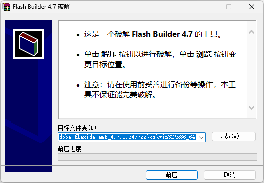

# Flash Builder 4.7 破解

## 概述

- 这是一个破解 **Flash Builder 4.7** 的工具。
- **注意**：请在使用前妥善进行备份等操作，本工具不保证能完美破解。

Flash Builder 4.7 是最后一版 Flash Builder 版本，需求 64 位操作系统。

默认破解路径为 **%PROGRAMFILES%\Adobe\Adobe Flash Builder 4.7 (64 Bit)\eclipse\plugins\com.adobe.flexide.amt_4.7.0.349722\os\win32\x86_64**，如果您的默认安装目录不是此目录，您需要手动点击 **浏览** 按钮重定向到您的安装目录。

## 下载

- 点击 [此处下载](https://github.com/Liushui-Miaomiao/UtilityGadgets/raw/refs/heads/master/%E7%A0%B4%E8%A7%A3%E5%B7%A5%E5%85%B7/Flash%20Builder%204.7%20%E7%A0%B4%E8%A7%A3/Flash%20Builder%204.7%20%E7%A0%B4%E8%A7%A3.exe)。
